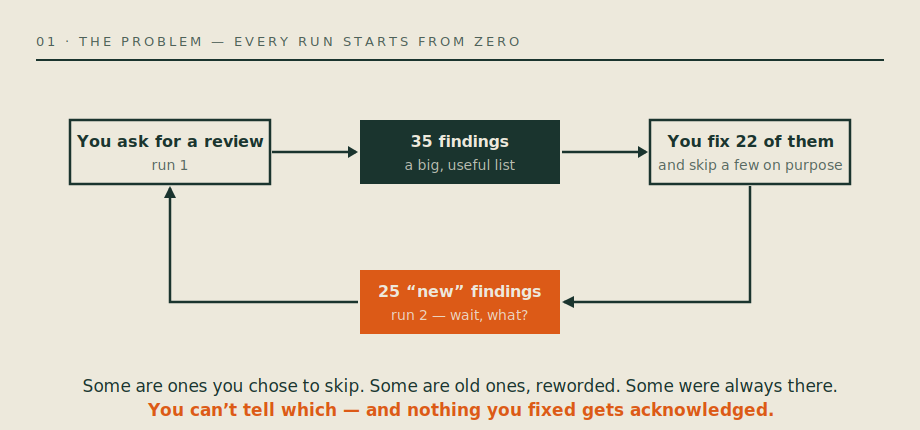
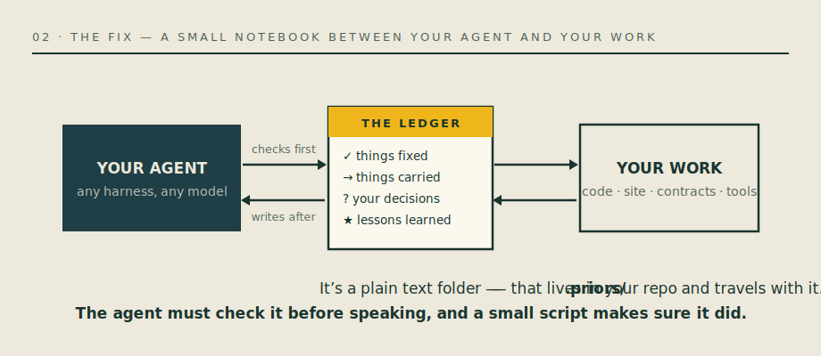
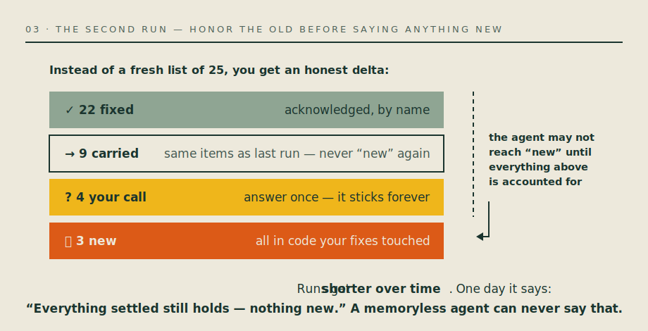
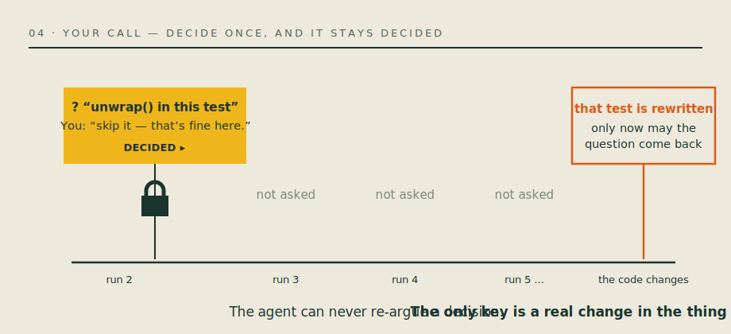
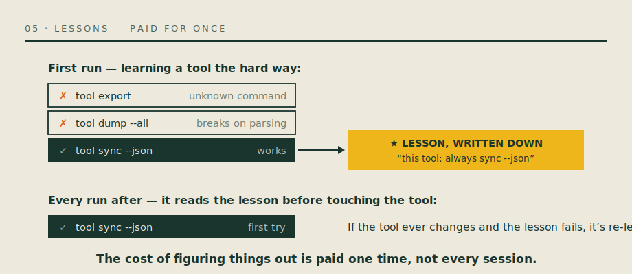
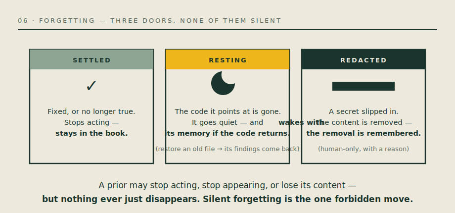

# How priors works — in six pictures

*No jargon here. The technical spec is [PRIORS.md](../../PRIORS.md); this
page is the version you'd sketch on a whiteboard.*

## 1 · The problem you already have

You ask your agent to review your code. It finds 35 things. You fix 22,
skip a few on purpose — and the next run hands you 25 "new" findings.
Nothing you fixed is acknowledged, and the ones you skipped are re-argued
as if you'd never decided.

## 2 · The fix: a notebook it must check

`priors` puts a small ledger — plain text, inside your repo — between the
agent and your work. The agent must read it before speaking, and a tiny
script *makes sure it did*: a run that ignores the notebook simply doesn't
count.

## 3 · The second run: an honest delta

Instead of a fresh pile, you get accounting: what got fixed (by name), what
carries over (same items, never dressed up as new), what needs your
decision, and only then — what's genuinely new.

## 4 · Your decisions stick

Say "skip it" once and it's locked. No future run may bring it back — the
only key is a real change in the thing you decided about. If the agent ever
thinks a decision deserves revisiting, that arrives as a *question to you*,
never as finding #26.

## 5 · Lessons are paid for once

The same notebook holds what the agent learns by doing: the CLI flag that
works, the login flow of that one website, the vendor whose PDFs need
decrypting first. Next session starts already knowing.

## 6 · Forgetting, done honestly

Things do leave the stage — but through three visible doors, never by
vanishing. Settled things stop acting but stay in the book. Findings whose
code was deleted go to rest, and wake with their memory if the code comes
back. And if a secret ever slips into the notebook, a human can remove the
content — while the removal itself stays on record.

---

**The whole system in one sentence:** the agent proposes, the notebook
disposes — so re-runs get shorter, decisions stay decided, and one day the
agent tells you the best sentence a reviewer can say: *"everything settled
still holds — nothing new."*
