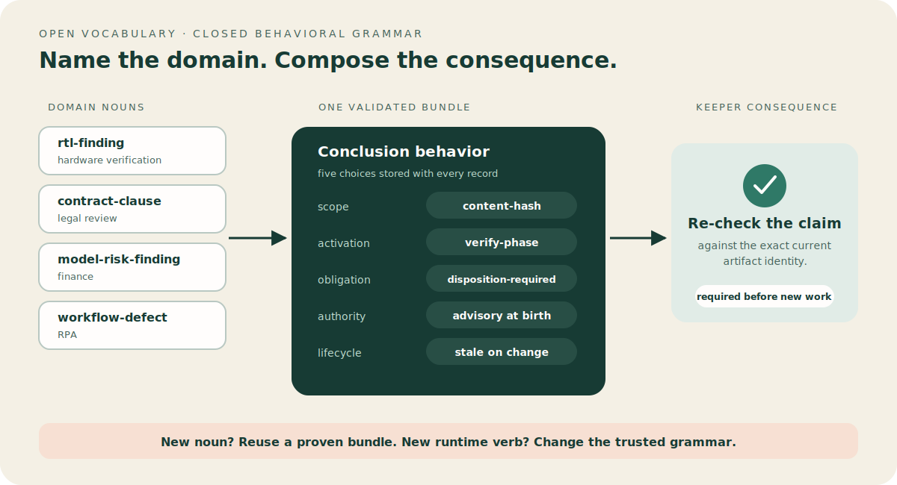
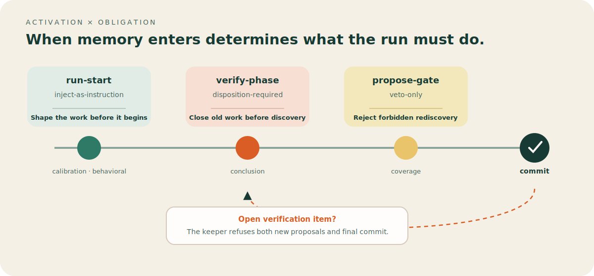
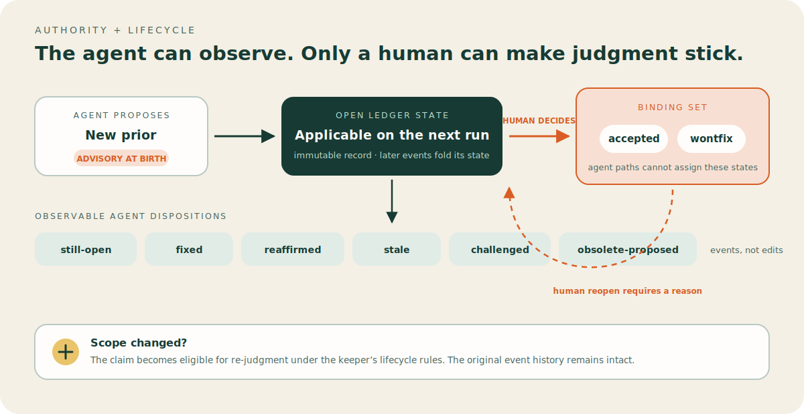
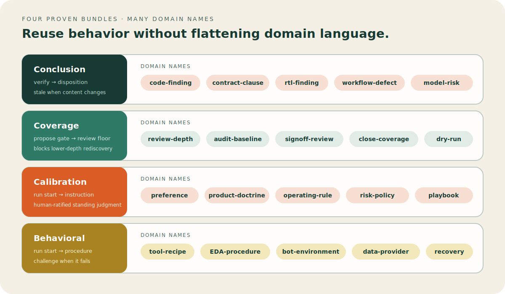
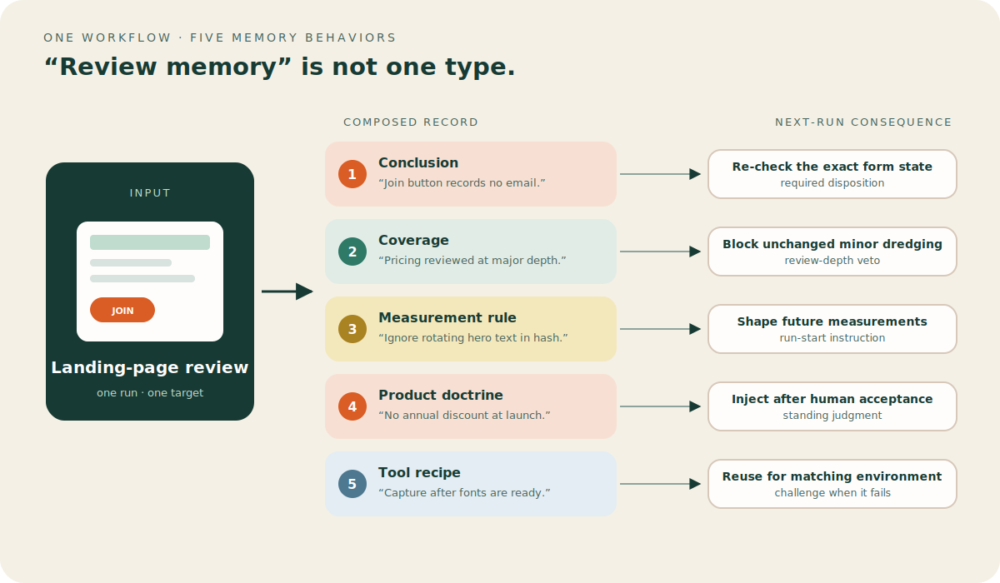
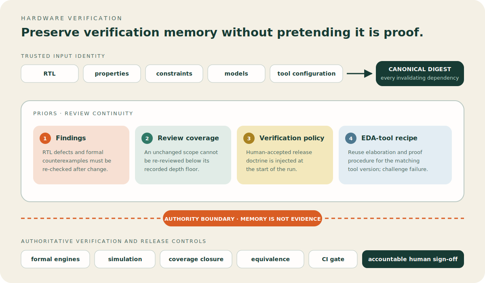
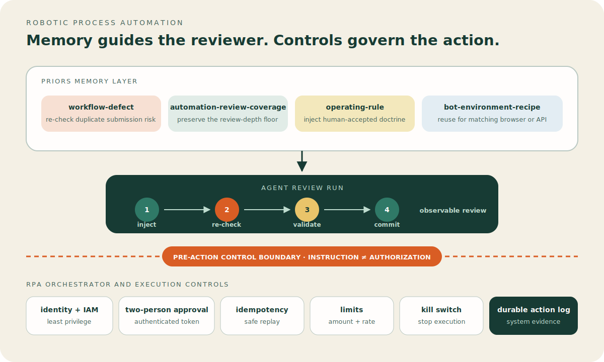
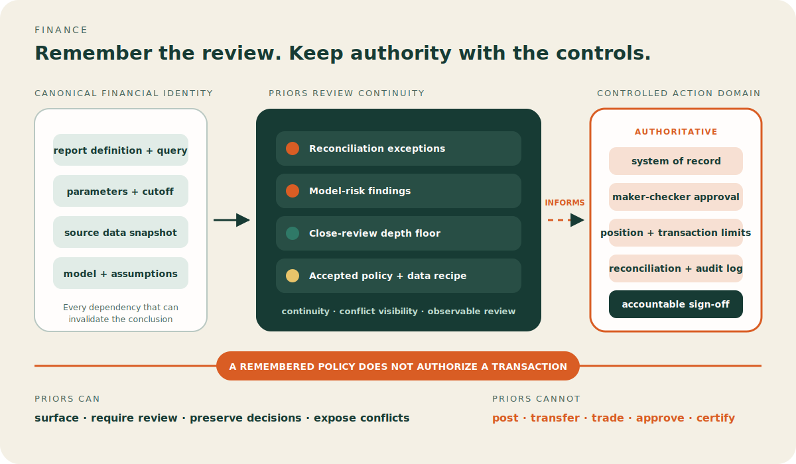
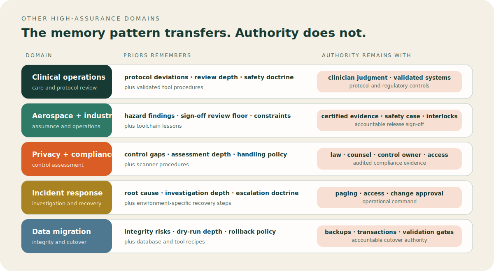
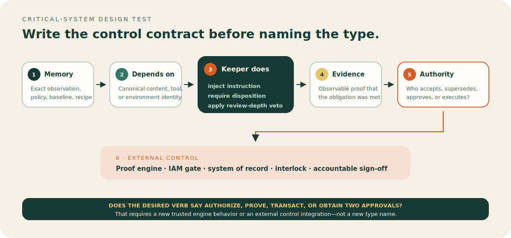

# Types are composed, not declared

*Why Priors defines a small grammar of memory behavior instead of an enum of
everything an agent might remember. Companion to [PRIORS.md](../PRIORS.md)
§§2–3.*

## The claim

Most memory systems use `type` to classify subject matter:

```text
finding | decision | preference | lesson | fact | procedure
```

That is useful vocabulary, but it does not tell a runtime what the memory must
*do*. Should it appear before work begins? Must the current run check it? Can
it veto a proposal? Does it stop applying when a file changes? Can the agent
retire it, or only a human?

Priors treats those behavioral questions as the primitive layer. A domain
type—`finding`, `preference`, `playbook`, `tool-recipe`, or a name nobody has
invented yet—is a human-friendly label for a validated bundle of answers.

The compact version is:

> **Keep the behavioral grammar closed; keep the domain vocabulary open.**

This is not an unrestricted algebra where every possible cross-product is
meaningful. It is a **factored type system with coherence constraints**. The
keeper validates and enforces the facets; people name the recurring bundles.



## The trap a closed enum creates

Suppose the engine begins with:

```json
{"type":"finding"}
```

Soon it also needs:

```text
decision
lesson
preference
policy
coverage-baseline
measurement-rule
negotiation-playbook
vendor-workaround
```

If behavior is implemented by branching on those names, each noun becomes a
feature request:

```js
if (record.type === "finding") { /* verify it */ }
if (record.type === "policy") { /* inject it */ }
if (record.type === "coverage-baseline") { /* veto low-depth proposals */ }
```

The vocabulary and engine become inseparable. Adding a legal playbook requires
the memory runtime to understand legal work. Adding a design preference makes
the keeper understand design. Migrations follow because old records only carry
a noun, not the behavior that noun implied in a particular release.

Priors separates those layers:

- **Vocabulary:** names people use in their domain.
- **Grammar:** the finite behaviors the keeper understands.
- **Preset:** a convenient name for a recurring facet bundle.
- **Record:** the expanded, self-describing bundle written to the ledger.

The keeper need not know what a `playbook` means to a lawyer. It only needs to
know that this record enters at run start, acts as an instruction, and remains
until a human explicitly retires it.

## The CSS analogy—and its limit

CSS does not need a special browser release for every new component name. A
button, card, chip, and toast are named bundles of lower-level properties.
New vocabulary reuses the same rendering grammar.

Priors follows that pattern. `conclusion`, `coverage`, `calibration`, and
`behavioral` are presets, not engine branches. A record is stored with its
facets expanded, so a reader can understand its behavior without knowing the
name.

The analogy has a useful limit: CSS properties combine very freely; Priors
facets do not. An instruction that activates after the work is complete makes
no sense, and a repo-wide rule has no content hash that can move. The keeper
therefore rejects incoherent bundles.

## The five facets

Every prior answers five questions:

| Facet | Question | Values in v0.3 |
|---|---|---|
| `scope` | What world-state does this depend on? | `content-hash` · `tool-version` · `env-fingerprint` · `repo-wide` |
| `activation` | When does it enter a run? | `run-start` · `verify-phase` · `propose-gate` |
| `obligation` | What must the run do with it? | `inject-as-instruction` · `disposition-required` · `veto-only` |
| `authority` | Who may make it binding or retire it? | `advisory` · `binding` as effective human-ratified state |
| `lifecycle` | What makes it eligible for re-judgment? | `stale-on-scope-change` · `challenged-on-failure` · `only-by-supersession` |

Together they describe a record's runtime contract, not its topic.

## 1. Scope: what must stay the same?

Scope is the prior's dependency on the outside world.

| Scope | Use it when the claim depends on | Example fingerprint |
|---|---|---|
| `content-hash` | Exact target content | Normalized function, file, page section, contract clause, or target-set hash |
| `tool-version` | Behavior of a particular tool release | Raw output of `tool --version` |
| `env-fingerprint` | A reproducible environment | Runtime, OS, dependency lock, feature flags, or a canonical combination |
| `repo-wide` | A standing convention or doctrine rather than one hashable target | No target hash; explicit human retirement governs change |

A scope is more than a retrieval filter. Before `relevant`, the harness builds
the complete scope map for the run. The keeper records that map as a trusted
snapshot. A candidate cannot invent a scope later or substitute a hash supplied
by the model.

That trust boundary is what lets Priors distinguish:

```text
same claim + same scope state     → already known
same claim + changed scope state → re-judge under the existing identity
new claim + known scope state     → eligible candidate
claim + unknown scope             → refuse and reopen with a complete snapshot
```

## 2–3. Activation and obligation: when does it act, and how?

These facets are deliberately coupled in the current grammar:

| Activation | Coherent obligation | Runtime consequence |
|---|---|---|
| `run-start` | `inject-as-instruction` | Put the prior in working context before the wrapped skill begins |
| `verify-phase` | `disposition-required` | Put the prior on the run's required check list |
| `propose-gate` | `veto-only` | Consult it while validating new candidates rather than presenting it as a finding |

The keeper rejects mismatched pairs. For example:

```text
run-start + disposition-required  ✗
verify-phase + inject-as-instruction  ✗
propose-gate + veto-only  ✓
```

Why keep them as two fields if they are currently paired? Because they answer
different questions and preserve the model's extension boundary. A future
grammar could add another activation phase or another obligation without
renaming every domain type. In v0.3, however, the three pairs above are the
implemented behaviors; documentation and custom types should not pretend that
the full 3 × 3 cross-product exists.



### `run-start`: shape the work

These priors behave like durable additions to the wrapped skill:

```text
Use the repository's in-memory test harness.
Keep product copy terse and concrete.
Decrypt Vendor Y PDFs before parsing.
```

The guarantee is deterministic exposure: the keeper returns them in `inject`.
It cannot prove what happened inside the model, so conformance relies on the
observable run protocol around that exposure.

### `verify-phase`: create work that must be closed

These priors are not merely recalled. They become obligations:

```text
P-0017 | unchanged | S3 client is constructed per request
P-0021 | changed   | form submission still drops the email address
```

The agent must record an allowed disposition for every applicable item before
it can propose anything new or commit the run. Changed content does not erase
the prior; it forces a re-judgment under the same identity.

### `propose-gate`: prevent rediscovery

These priors operate during proposal validation. In the v0.3 reference keeper,
the shipped and exercised use is a **coverage floor**: if an unchanged scope
was reviewed to `major` depth, a later run cannot emit `minor` findings from
that scope unless the user explicitly requests a deeper pass.

That distinction matters. `veto-only` is not currently a general policy engine
for arbitrary predicates. New veto families would require a new, specified
proposal predicate and conformance tests rather than only a new noun.

## 4. Authority: who gets to make memory stick?

Candidate records are always born advisory. A candidate that tries to set:

```json
{"authority":"binding"}
```

is refused. The agent proposal path can suggest a record; it cannot legislate.

Human ratification is append-only. The original prior remains immutable and a
later event changes its effective state:

```json
{"t":"event","id":"P-0009","action":"decide","to":"accepted","by":"human"}
```

When the ledger is folded, `accepted` and `wontfix` are binding states:

- an accepted run-start instruction remains injected and cannot be retired by
  an agent disposition;
- a `wontfix` conclusion blocks the same issue from being re-raised on the
  same scope state;
- reopening requires the human decision path and a reason.

The reference CLI cannot authenticate human identity at the operating-system
level. What it mechanically guarantees is that candidate and agent-disposition
paths cannot assign binding authority. A conforming harness exposes `decide`
only after an explicit human instruction.

For repo-wide instructions, binding does **not** mean that the keeper can
understand every semantic contradiction. It means the instruction remains
deterministically injected and agent-immutable. Mechanical rejection is only
available where the keeper has a concrete proposal predicate, such as
same-identity re-raises, reversals on trusted scope state, or coverage floors.

## 5. Lifecycle: what causes re-judgment?

| Lifecycle | Trigger | What happens |
|---|---|---|
| `stale-on-scope-change` | Trusted scope fingerprint moves | The record keeps its identity and is checked against the new state |
| `challenged-on-failure` | An injected procedure fails in practice | The agent records a challenge; a human decides whether to keep or retire it |
| `only-by-supersession` | Explicit human decision | The rule remains active; neglect and elapsed time do not silently erase it |

“Stale” never means forgotten. For a changed content scope, the next event may
say the issue is fixed, reaffirm the same claim under the current trusted hash,
or propose that it is obsolete. History survives all three.

Similarly, a failed tool recipe is not silently overwritten by a newly sampled
procedure. It becomes `challenged`, creating one visible keep-or-retire call.

The v0.3 reference keeper exercises these lifecycle patterns through its
shipped bundles. The `lifecycle` field declares the record's contract and keeps
the ledger self-describing; it should not be read as a promise that every
mathematically possible facet tuple already has independent engine behavior.



## Coherence rules

The current keeper enforces these rules when a candidate is proposed:

1. All five facet values must come from the closed grammar.
2. `inject-as-instruction` requires `run-start`.
3. `disposition-required` requires `verify-phase`.
4. `veto-only` requires `propose-gate`.
5. `repo-wide` cannot use `stale-on-scope-change` because there is no scope
   hash to move.
6. `binding` cannot enter through a candidate; ratification is a human event.

These constraints are why “factored” or “composable” is more accurate than
“fully orthogonal.” The facets remain separately meaningful, but valid bundles
occupy a deliberate subset of the theoretical cross-product.

## What actually gets stored

Suppose a design review discovers a durable preference:

```json
{
  "type": "preference",
  "facets": {
    "scope": "repo-wide",
    "activation": "run-start",
    "obligation": "inject-as-instruction",
    "authority": "advisory",
    "lifecycle": "only-by-supersession"
  },
  "claim": "Use sharp geometry; rounded cards were rejected twice",
  "direction": "sharp-geometry",
  "review_every": 20
}
```

After validation and commit, the ledger stores the expanded record:

```json
{
  "t": "prior",
  "id": "P-0012",
  "ns": "design-review",
  "type": "preference",
  "facets": {
    "scope": "repo-wide",
    "activation": "run-start",
    "obligation": "inject-as-instruction",
    "authority": "advisory",
    "lifecycle": "only-by-supersession"
  },
  "claim": "Use sharp geometry; rounded cards were rejected twice",
  "direction": "sharp-geometry",
  "review_every": 20,
  "born": "run-006"
}
```

If the human accepts it, the keeper appends a decision event. It does not edit
`P-0012` or rewrite `authority` in place. Current authority is obtained by
folding the prior and its later events.

Expanded storage has three benefits:

- old ledgers remain readable if preset definitions later change;
- another implementation can enforce the record without sharing the same
  registry names;
- a domain name can evolve without hiding its runtime behavior.

## The four shipped behavioral bundles

The reference registry ships four presets:

| Preset | Facet bundle | Proven runtime role |
|---|---|---|
| `conclusion` | content-hash · verify-phase · disposition-required · advisory-at-birth · stale-on-scope-change | Re-check a claim about a concrete target |
| `coverage` | content-hash · propose-gate · veto-only · advisory-at-birth · stale-on-scope-change | Enforce a review-depth floor on unchanged scopes |
| `calibration` | repo-wide · run-start · inject-as-instruction · advisory-at-birth · only-by-supersession | Carry durable judgment, doctrine, or preference into future runs |
| `behavioral` | tool-version · run-start · inject-as-instruction · advisory-at-birth · challenged-on-failure | Reuse a learned procedure until field evidence challenges it |

An environment-scoped behavioral type can use the same proven behavior with
`scope: env-fingerprint` supplied explicitly.

The important thing is that these are **behavior families**, not a claim that
the world contains only four kinds of memory.



## One bundle, many use cases

### The conclusion family: claims about changing targets

All of the following can reuse the `conclusion` behavior:

| Domain type | Example claim | Scope reference |
|---|---|---|
| `code-finding` | “The S3 client is constructed per request.” | `src/upload.ts#handleUpload` |
| `security-gap` | “This callback accepts an unverified redirect target.” | `src/auth/callback.ts#complete` |
| `accessibility-gap` | “The dialog has no programmatic label.” | `checkout#payment-dialog` |
| `contract-clause` | “The indemnity is uncapped for third-party claims.” | `msa.pdf#section-8.2` |
| `data-anomaly` | “Refund rows can lack an originating charge id.” | `warehouse/refunds.sql#result-schema` |
| `research-conclusion` | “The reported lift disappears after segment normalization.” | `analysis.ipynb#experiment-4` |

They share behavior because each claim depends on exact target content, must be
re-checked on the next run, and becomes questionable when that content changes.
The keeper does not need six branches.

Example candidate:

```json
{
  "type": "contract-clause",
  "facets": {
    "scope": "content-hash",
    "activation": "verify-phase",
    "obligation": "disposition-required",
    "authority": "advisory",
    "lifecycle": "stale-on-scope-change"
  },
  "scope_ref": "msa.pdf#section-8.2",
  "scope_hash": "from-the-run-snapshot",
  "claim": "The indemnity is uncapped for third-party claims",
  "direction": "cap-third-party-indemnity",
  "severity": "gate"
}
```

On a later contract version, the section hash moves. The clause does not vanish
or become a new finding. It returns as the same prior requiring re-judgment.

### The coverage family: contracts against rediscovery

Coverage records describe what was already inspected, at what depth:

| Domain type | Example | Result on unchanged scope |
|---|---|---|
| `review-coverage` | “Reviewed `src/api/` at major depth.” | Refuse minor code-review findings below that floor |
| `audit-baseline` | “Audited checkout critical path at gate depth.” | Refuse lower-severity rediscovery |
| `contract-coverage` | “Reviewed liability and termination sections at major depth.” | Preserve the agreed review boundary |
| `accessibility-coverage` | “Keyboard and screen-reader pass completed at major depth.” | Avoid an unsolicited cosmetic/nit pass |

Coverage is memory that normally should not be shown as advice. Its value is
negative: it prevents the system from moving the goalposts.

When the parent scope hash changes, the floor no longer blocks findings for
that changed state. Coverage follows the world instead of becoming a permanent
excuse not to look again.

### The calibration family: standing judgment

These names all map naturally to the calibration behavior:

| Domain type | Example instruction | Why repo-wide? |
|---|---|---|
| `design-preference` | “Use sharp geometry; avoid rounded cards.” | It guides the whole design language |
| `product-doctrine` | “Do not offer launch discounts.” | It is a standing product decision |
| `negotiation-playbook` | “Fallback liability cap is 12 months of fees.” | It applies across contract reviews |
| `editorial-rule` | “Lead with the problem before product mechanics.” | It guides every relevant writing run |
| `risk-tolerance` | “Treat unauthenticated data export as a release gate.” | It calibrates severity judgments |
| `measurement-rule` | “Strip live animation text before hashing the hero.” | It tells future runs how to measure consistently |

The record starts advisory. Human acceptance makes it effectively binding: it
remains injected and cannot be retired through the agent path. A periodic
`review_every` nudge can ask whether it is still true, but neglect never
silently expires it.

### The behavioral family: learned procedures

These types remember how to operate in a particular tool or environment:

| Domain type | Example instruction | Scope |
|---|---|---|
| `tool-recipe` | “Use `--json` or the CLI truncates nested results.” | Tool version |
| `vendor-procedure` | “Run `qpdf --decrypt` before parsing Vendor Y files.” | Tool/vendor fingerprint |
| `environment-quirk` | “Set the test timezone to UTC before snapshot tests.” | Environment fingerprint |
| `deployment-lesson` | “Build assets before generating the edge manifest.” | Toolchain fingerprint |
| `adapter-workaround` | “Request pages sequentially; this API invalidates parallel cursors.” | Adapter version |

These are injected before work begins. If the recipe fails in practice, the
agent may record `challenged`; the challenge is surfaced for a human decision
instead of silently replacing a previously successful procedure.

## Composition across one real workflow

A single landing-page review can create several types because “memory from a
review” is not one behavior:

1. **Conclusion:** “The join button records no email.” It is tied to the form
   section hash and must be checked next run.
2. **Coverage:** “Pricing and signup were reviewed at major depth.” It prevents
   a later run from filling the report with unchanged nits.
3. **Measurement rule:** “Ignore rotating hero text when computing the stable
   hero fingerprint.” It is injected before future measurements.
4. **Product doctrine:** “No annual discount at launch.” It begins advisory;
   human acceptance makes it a durable instruction.
5. **Tool recipe:** “Capture the page after `document.fonts.ready`.” It is
   scoped to the capture environment and can be challenged if that procedure
   stops working.



Calling all five `review-memory` would hide their different consequences.
Hard-coding five domain features would couple the keeper to web design. Facets
let one run produce a checkable finding, a veto-only baseline, two standing
instructions, and a fallible procedure using the same protocol.

The same pattern transfers:

- a legal review yields clause conclusions, section coverage, a negotiation
  playbook, and a PDF-processing recipe;
- a security review yields scoped vulnerabilities, an audit-depth floor,
  severity calibration, and environment-specific reproduction steps;
- a research run yields scoped conclusions, experiment coverage, an evaluation
  rule, and a tool-version-specific analysis procedure;
- a hardware verification run yields scoped RTL findings, a sign-off review
  baseline, verification policy, and EDA-tool procedures;
- an RPA review yields workflow defects, automation coverage, operating rules,
  and browser or API environment lessons;
- a finance review yields reconciliation exceptions, close-review coverage,
  accounting or risk policy, and data-provider procedures.

## Composition in critical workflows

Critical systems make the boundary of composition especially important. A
Priors record can deterministically affect an agent run. It does not become a
proof artifact, transaction authority, safety interlock, or accountable human
approval merely because its type has a serious-sounding name.

A grounded design answers three questions for every prior:

1. **What exact artifact or environment does the memory depend on?**
2. **What observable keeper consequence follows next time?**
3. **Which external control remains authoritative?**

If the second answer is not instruction injection, disposition-required
verification, or the implemented review-depth veto, the use case may need a
new engine verb rather than a new domain noun.

### Hardware verification

Hardware verification has several kinds of memory with different operational
consequences. Treating all of them as `verification-memory` would discard those
differences.

| Domain type | Proven bundle | Example | Next-run consequence |
|---|---|---|---|
| `rtl-finding` | Conclusion | “Reset deassertion crosses into `core_clk` without synchronization.” | Re-check and disposition the finding when the scoped RTL identity is active. |
| `proof-finding` | Conclusion | “Property `p_ack_eventually` has a counterexample at depth 37.” | Re-run or otherwise re-evaluate the claim against the scoped design/property identity. |
| `signoff-review-coverage` | Coverage | “CDC and reset handling were reviewed at sign-off depth.” | Veto a shallower review proposal while the covered identity is unchanged. |
| `verification-policy` | Calibration | “Release candidates require disposition of unresolved severity-gate findings.” | Inject the human-accepted policy at run start. |
| `eda-tool-recipe` | Behavioral | “Use the formal tool's multiclock elaboration mode for this block.” | Inject the recipe for the matching tool version; challenge it if it fails. |



The scope extractor matters. A proof result may depend on RTL, properties,
constraints, black-box models, and tool configuration. Hashing only the RTL
would give a false impression of freshness. The harness should compute a
canonical composite identity over every dependency that can invalidate the
claim, then submit that identity as the content scope.

The coverage prior above means **agent review-depth coverage** because that is
the predicate the current keeper implements. It is not a simulator code-
coverage number, functional-coverage closure, formal completeness claim, or
sign-off certificate. Likewise, injected verification policy makes the policy
deterministically visible in the run context; CI, the formal or simulation
environment, and the accountable sign-off process must enforce the actual
release gate.

A composed hardware-verification run might therefore:

1. inject accepted `verification-policy` and the matching `eda-tool-recipe`;
2. compare the current composite design identity with prior findings;
3. require a disposition for each active `rtl-finding` and `proof-finding`;
4. reject a proposed shallow review when unchanged `signoff-review-coverage`
   already records a deeper pass; and
5. write new observations only after the keeper validates the proposal.

Priors preserves verification memory across runs. Simulation, assertions, UVM,
formal engines, equivalence checking, coverage closure, and human sign-off
remain the sources of verification evidence and authority.

### Robotic process automation (RPA)

RPA combines changing workflows, fragile environments, and actions with real
side effects. Its memories also separate cleanly:

| Domain type | Proven bundle | Example | Next-run consequence |
|---|---|---|---|
| `workflow-defect` | Conclusion | “The invoice bot retries after a partial submission and can duplicate the request.” | Re-check and disposition against the scoped workflow/selector identity. |
| `automation-review-coverage` | Coverage | “Failure recovery and replay safety were reviewed at major depth.” | Prevent an unchanged workflow from being re-reported through a shallower pass. |
| `operating-rule` | Calibration | “Never submit after validation fails; route the item to exception handling.” | Inject the human-accepted rule at run start. |
| `bot-environment-recipe` | Behavioral | “Wait for the export job ID, not the browser spinner, before downloading.” | Reuse for the matching browser/API environment and challenge on failure. |



Scope should include the workflow definition plus dependencies such as selector
contracts, API schemas, or form versions. `env-fingerprint` should capture the
browser, driver, OCR model, connector, or runtime versions that make an
operating lesson valid. Broad labels such as “production bot” are not stable
identities.

An `operating-rule` is still an injected instruction. A bot that must obtain
two-person approval immediately before submitting a payment needs a trusted
pre-action gate, authenticated approvers, and an approval token. The current
grammar has no `pre-tool-call` activation or `external-approval-token`
obligation. Renaming a calibration prior to `payment-approval` would not add
those semantics. Implement the gate in the RPA orchestrator or add a reviewed,
tested keeper verb for it.

Credentials, least-privilege access, idempotency keys, transaction limits,
segregation of duties, kill switches, and durable execution logs remain runtime
controls. Priors can ensure a conforming run surfaces and accounts for the
recorded reasons for them.

### Finance

Finance benefits from durable review memory, but authority must stay with the
controlled books, transaction systems, and accountable approvers.

| Domain type | Proven bundle | Example | Next-run consequence |
|---|---|---|---|
| `reconciliation-exception` | Conclusion | “Three settlements do not tie to the processor report because the cutoff differs.” | Re-check and disposition against the scoped report/query identity. |
| `model-risk-finding` | Conclusion | “The stress model applies a stale recovery-rate assumption to secured debt.” | Re-evaluate when the canonical model, assumptions, data snapshot, or query identity changes. |
| `close-review-coverage` | Coverage | “Revenue cutoff and cash reconciliation were reviewed at major depth.” | Enforce the existing review-depth floor for unchanged scoped material. |
| `accounting-policy` | Calibration | “Classify these pass-through fees as contra-revenue under the approved policy.” | Inject the human-accepted policy into later runs. |
| `market-data-recipe` | Behavioral | “Request the adjusted series and record the provider revision timestamp.” | Reuse for the matching API/tool version and challenge if it stops working. |



For reproducibility, a financial content identity often needs more than a file
hash. It may be a canonical digest of the report definition, query text,
parameters, source snapshot, model version, assumptions, and relevant calendar
or cutoff. The identity design should be documented and independently tested;
otherwise a carried finding can look current while an unseen input changed.

The coverage bundle records the depth of the **agent review**. It does not prove
completeness of audit evidence or satisfy an accounting, regulatory, or model-
risk standard by itself. A binding `accounting-policy` is binding within the
Priors run protocol after a human decision; it does not authorize a journal
entry, payment, transfer, credit decision, or trade.

Systems of record, maker-checker approval, segregation of duties, position and
transaction limits, reconciliations, immutable audit logs, and regulatory or
fiduciary sign-off remain external controls. Priors supplies continuity and
conflict visibility to the agents working around those controls.

### Other high-assurance domains

The same four proven bundles cover a useful slice of other critical work:

| Domain | Conclusion | Coverage | Calibration | Behavioral | External authority that remains |
|---|---|---|---|---|---|
| Clinical or medical operations | Protocol deviation or evidence finding | Review-depth baseline | Human-approved safety doctrine | Validated tool procedure | Clinician judgment, validated systems, protocol, and regulatory controls |
| Aerospace or industrial systems | Hazard or assurance finding | Sign-off review baseline | Operating constraint | Toolchain lesson | Certified evidence, safety case, interlocks, and accountable sign-off |
| Privacy and compliance | Control gap | Assessment-depth baseline | Handling or retention policy | Scanner procedure | Law, counsel, control owner, access control, and audited evidence |
| Incident response | Root-cause or exposure finding | Investigation-depth baseline | Escalation doctrine | Environment-specific recovery step | Paging, access control, change approval, and operational command |
| Data migration | Integrity or rollback finding | Dry-run review baseline | Cutover policy | Database/tool recipe | Backups, transactions, validation gates, and cutover authority |



This table is a map to known behavior, not a certification claim. Each domain
still needs a precise scope extractor, evidence requirements, conformance tests,
and accountable ownership.

### A critical-system design test

Before minting a type, write a short control contract:

```text
Memory:      the exact observation, policy, baseline, or procedure
Depends on: the canonical content/tool/environment identity
Keeper does: inject | require disposition | apply review-depth veto
Evidence:    what proves the next-run obligation was satisfied
Authority:   who may accept, supersede, approve, or execute
External:    the proof engine, IAM gate, system of record, interlock, or sign-off
```

If `Keeper does` says “authorize,” “prove,” “block a transaction,” “obtain two
approvals,” or another action outside the three implemented behaviors, stop.
That is a request for a new trusted verb or an external control integration,
not merely another composition of existing facets.



## Minting a domain type

For a new noun, use this procedure:

1. **Write the consequence first.** What must be different in the next run
   because this record exists?
2. **Choose a proven activation/obligation pair.** Instruction, required
   re-check, or coverage veto?
3. **Choose the dependency.** Exact content, tool version, environment, or
   repo-wide doctrine?
4. **Choose the lifecycle that the keeper actually supports for that behavior.**
5. **Give the bundle a domain name people will recognize.**
6. **Submit the name with explicit facets and test the expected run behavior.**

One-off and domain-specific names need no `if type == ...` branch. The current
CLI accepts an arbitrary `type` when all facets are supplied explicitly and
stores the expanded bundle.

The four convenient presets live in the declarative `TYPES` registry inside
the reference keeper. Adding a new built-in shorthand currently changes that
registry source, even though it adds no new keeper behavior. “No engine change”
therefore means **no new control-flow semantics**, not literally no repository
diff. A future external preset registry could make built-in vocabulary fully
data-driven.

## When a new use case really does require an engine change

Composition avoids changes for new **nouns**. It cannot avoid changes for new
**verbs**.

An engine/spec change is appropriate when a use case needs:

- a new kind of trusted scope or fingerprint;
- a new activation phase, such as before a destructive tool call;
- a new obligation, such as two-person approval;
- a new proposal predicate beyond duplicate, reversal, re-raise, or depth
  floor checks;
- a new authority class or authenticated identity model;
- a new lifecycle transition with different keeper behavior.

That boundary is a feature. The vocabulary can grow cheaply, while additions
to the trusted behavioral grammar remain explicit, reviewed, and covered by
conformance tests.

## What composition is not

### Not tagging

A tag helps retrieval. A facet bundle changes the run protocol and may prevent
the run from committing.

### Not a data ontology

An ontology says what fields or relationships a record contains. Priors says
when the record acts, what it obliges, and how its force changes.

### Not arbitrary prompt metadata

The model does not choose whether a field matters. The keeper validates the
closed values and implements the resulting state transitions.

### Not proof of model attention

The system cannot inspect cognition. It guarantees deterministic exposure,
required dispositions, mechanical proposal checks, and fail-closed recording.

### Not unlimited composition

The valid space is intentionally constrained, and v0.3's strongest guarantees
are the behaviors exercised by the shipped presets and invariant tests.

## Why this representation matters

Factored behavioral types provide several practical advantages:

- **Extensibility:** new domain vocabulary reuses existing keeper semantics.
- **Auditability:** the ledger explains behavior without consulting a mutable
  type registry.
- **Portability:** another implementation can enforce facets even if it uses
  different preset names.
- **Migration safety:** a registry rename does not reinterpret old records.
- **Governance:** human authority is a visible event rather than a field the
  agent can forge.
- **Testing:** conformance tests target a small grammar and its transitions,
  not an ever-growing list of domain nouns.

## The compact version

Priors does not need a special engine feature for a design preference, legal
playbook, research conclusion, or vendor procedure. It needs each record to
answer five behavioral questions using a constrained grammar.

The type name is for people. The expanded facets are for implementations. The
append-only events are how authority and lifecycle evolve. The keeper enforces
the consequences it can observe.

> **Define the grammar, not every future vocabulary word. New nouns compose;
> new trusted behavior earns a spec change.**
